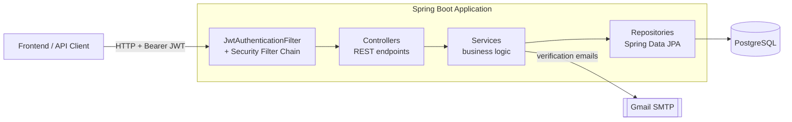
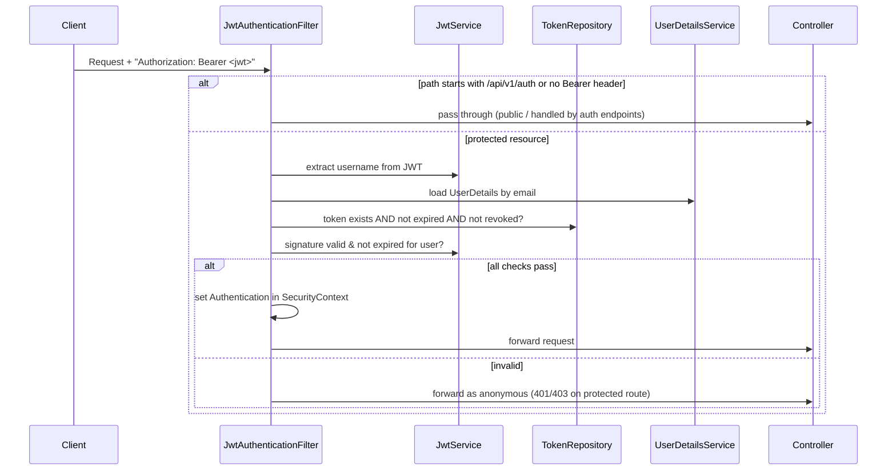
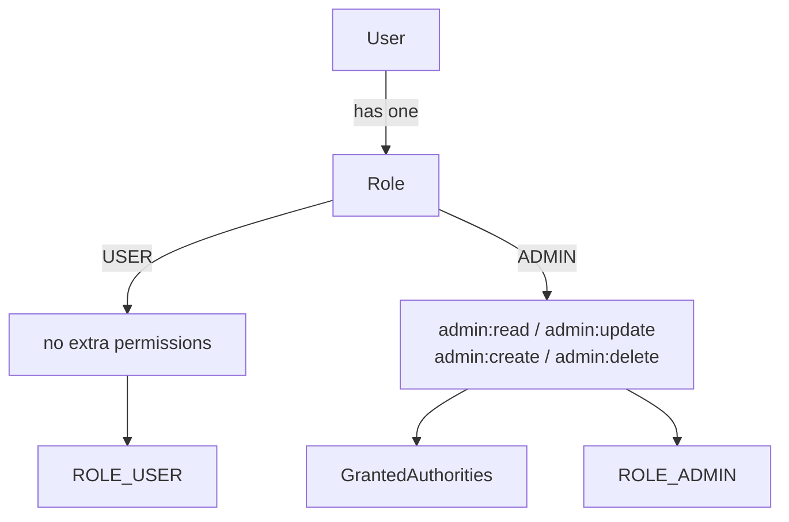
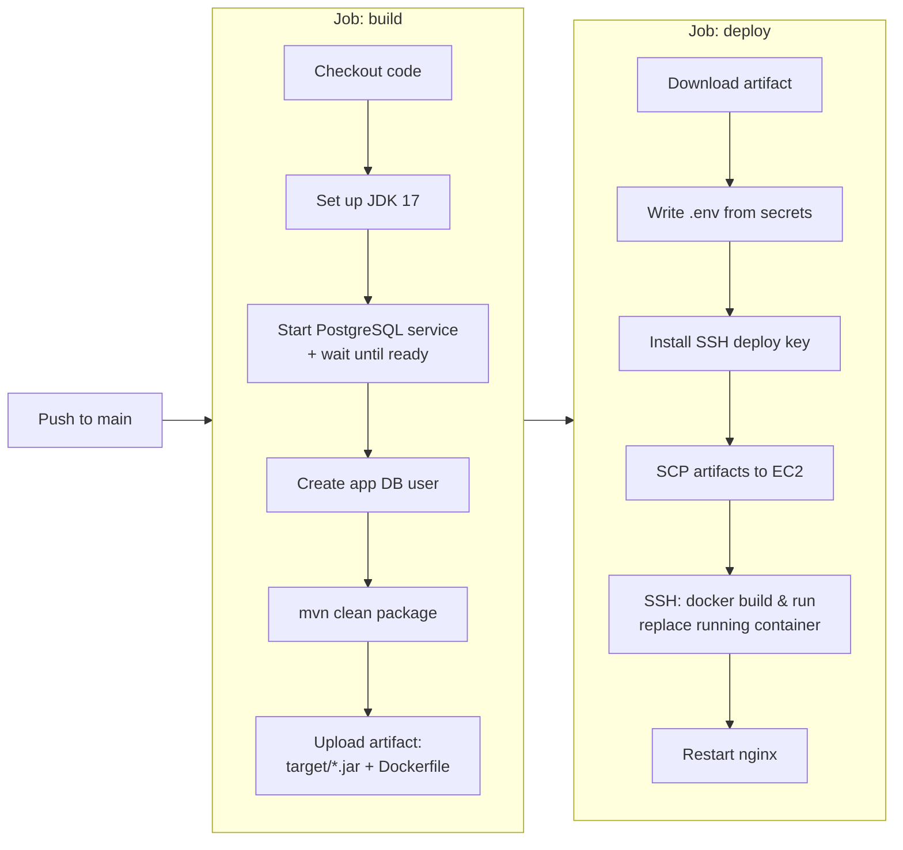

# IST Signatures

Backend service that powers the **IST Signatures** platform — an email-signature generator with
user onboarding, email verification, JWT-based authentication, role-based authorization and company
profile management. Built with Spring Boot 3 and PostgreSQL, documented with OpenAPI, and deployed
to AWS EC2 through GitHub Actions.

---

## Table of Contents

- [Features](#features)
- [Technologies](#technologies)
- [Architecture](#architecture)
  - [High-level overview](#high-level-overview)
  - [Layered design](#layered-design)
  - [Request & authentication flow](#request--authentication-flow)
  - [Authorization model (RBAC)](#authorization-model-rbac)
- [Project Structure](#project-structure)
- [Architectural Decisions](#architectural-decisions)
- [CI/CD Pipeline (GitHub Actions)](#cicd-pipeline-github-actions)
- [Getting Started](#getting-started)
- [Configuration](#configuration)
- [API Overview](#api-overview)
- [Testing](#testing)

---

## Features

- User registration and login with JWT authentication
- Password encryption using BCrypt
- Role-based authorization with Spring Security (`USER` / `ADMIN` + fine-grained permissions)
- Email verification via signed links
- Company profile management (read / update)
- User profile updates (phone, position, password)
- Stateless session management with a server-side token registry
- Logout that revokes the active token
- Access + refresh token rotation
- Persistence auditing (created/modified by & timestamps)
- Centralized exception handling
- Interactive API documentation with Swagger / OpenAPI

## Technologies

- Spring Boot 3.1.4
- Spring Security 6
- Spring Data JPA / Hibernate
- JSON Web Tokens (JWT) — `jjwt` 0.11.5
- BCrypt password hashing
- PostgreSQL
- Spring Mail (SMTP)
- springdoc-openapi (Swagger UI)
- Maven
- Docker & Docker Compose
- JUnit 5, Spring Security Test, Testcontainers
- GitHub Actions (CI/CD) → AWS EC2

---

## Architecture

The application follows a classic **layered (n-tier) architecture** on top of Spring Boot. HTTP
requests pass through a security filter chain, are handled by thin controllers, delegated to
services that hold the business logic, and persisted through Spring Data repositories to PostgreSQL.
It is a **stateless** service: no HTTP session is kept — every authenticated request must carry a
JWT, which is validated against a server-side token registry.

### High-level overview



### Layered design

| Layer | Package | Responsibility |
| --- | --- | --- |
| **Web / Controllers** | `controllers` | Expose REST endpoints under `/api/v1/**`, validate input, return `ResponseEntity`. Method-level authorization via `@PreAuthorize`. |
| **Service** | `services` | Business logic: authentication, token lifecycle, user & company operations, email sending, logout. |
| **Repository** | `repositories` | Data access with Spring Data JPA (`UserRepository`, `TokenRepository`, `CompanyRepository`). |
| **Domain / Models** | `models` | JPA entities (`User`, `Token`, `Company`) and RBAC enums (`Role`, `Permission`, `TokenType`). |
| **DTOs** | `dtos` | Request/response payloads decoupled from entities. |
| **Configuration** | `config` | Security, JWT filter, authentication provider, CORS, mail, OpenAPI, auditing wiring. |
| **Cross-cutting** | `auditing`, `exceptions` | Auditing (`AuditorAware`) and global exception handling (`@RestControllerAdvice`). |

### Request & authentication flow

Every request (except the public allow-list) is intercepted by `JwtAuthenticationFilter`
(a `OncePerRequestFilter`) before it reaches a controller. The token must be both cryptographically
valid **and** present as a non-revoked, non-expired row in the token registry.



Key points:

- **Authentication** issues a short-lived access token (1 day) and a refresh token (7 days).
  On each successful login all previously valid tokens for the user are revoked, then the new access
  token is persisted (`revokeAllUserTokens` → `saveUserToken`).
- **Registration** creates a disabled user and emails a signed verification link; the account is
  enabled only after the link is visited (`/api/v1/auth/verify`).
- **Refresh** exchanges a valid refresh token for a new access token, again rotating stored tokens.
- **Logout** (`/api/v1/auth/logout`) marks the presented token as expired + revoked and clears the
  security context.

### Authorization model (RBAC)

Authorization is expressed as **roles composed of permissions**. Each `User` has a single `Role`;
each `Role` maps to a set of fine-grained `Permission` values, which become Spring Security
authorities. Endpoints are guarded with `@PreAuthorize("hasAuthority('admin:update')")` and similar.



---

## Project Structure

```
ist-signature-be/
├── .github/workflows/
│   └── main.yml                 # CI/CD: build → deploy to EC2
├── docker-compose.yml           # Local PostgreSQL
├── pom.xml                      # Maven build & dependencies
├── mvnw / mvnw.cmd              # Maven wrapper
├── jwt-security.drawio          # Auth flow design diagram
└── src/
    ├── main/
    │   ├── java/com/redjanvier/signature/
    │   │   ├── SecurityApplication.java      # Spring Boot entry point
    │   │   ├── auditing/                      # AuditorAware implementation
    │   │   │   └── ApplicationAuditAware.java
    │   │   ├── config/                        # Cross-cutting configuration
    │   │   │   ├── ApplicationConfig.java     # Auth provider, encoder, auditor, UserDetailsService
    │   │   │   ├── AuditConfig.java           # Enables JPA auditing
    │   │   │   ├── JwtAuthenticationFilter.java
    │   │   │   ├── MailConfig.java            # JavaMailSender (SMTP)
    │   │   │   ├── OpenApiConfig.java         # Swagger / OpenAPI metadata
    │   │   │   └── SecurityConfiguration.java # Filter chain, CORS, allow-list
    │   │   ├── controllers/                   # REST endpoints
    │   │   │   ├── AuthenticationController.java
    │   │   │   ├── CompanyController.java
    │   │   │   └── UserController.java
    │   │   ├── dtos/                          # Request/response payloads
    │   │   ├── exceptions/
    │   │   │   └── GlobalExceptionHandler.java
    │   │   ├── models/                        # JPA entities + RBAC enums
    │   │   │   ├── User.java  Token.java  Company.java
    │   │   │   └── Role.java  Permission.java  TokenType.java
    │   │   ├── repositories/                  # Spring Data JPA
    │   │   └── services/                      # Business logic
    │   │       ├── AuthenticationService.java
    │   │       ├── CompanyService.java
    │   │       ├── JwtService.java
    │   │       ├── LogoutService.java
    │   │       └── UserService.java
    │   └── resources/
    │       └── application.yml                # Externalized configuration
    └── test/
        ├── java/com/redjanvier/signature/     # JUnit + Testcontainers
        └── resources/                         # test config & seed data
```

---

## Architectural Decisions

The following decisions shape how the service is built and why.

| # | Decision | Rationale |
| --- | --- | --- |
| 1 | **Stateless authentication (`SessionCreationPolicy.STATELESS`)** | No server-side HTTP session; the service scales horizontally and each request is self-contained via its JWT. |
| 2 | **Server-side token registry (`Token` entity)** in addition to stateless JWT | Enables true logout and token revocation — a signed JWT alone cannot be invalidated. The `JwtAuthenticationFilter` checks the DB so revoked/expired tokens are rejected immediately. |
| 3 | **Access + refresh token rotation** | Short-lived access tokens (1 day) limit exposure; refresh tokens (7 days) keep users signed in. Prior tokens are revoked on each login/refresh to prevent reuse. |
| 4 | **RBAC as roles-of-permissions** (`Role` → `Set<Permission>`) | Fine-grained, `@PreAuthorize`-based authorization that is easy to extend without touching endpoint code. |
| 5 | **Layered architecture** (controller → service → repository) | Clear separation of concerns, testability, and a thin web layer that delegates all logic to services. |
| 6 | **DTOs separate from entities** | Prevents leaking persistence details/relationships over the wire and shapes responses per use case. |
| 7 | **Custom `JwtAuthenticationFilter` before `UsernamePasswordAuthenticationFilter`** | Bearer-token authentication is resolved once per request and populates the `SecurityContext` before authorization runs. |
| 8 | **Externalized configuration via environment variables** (`application.yml` + optional `.env`) | Secrets (DB credentials, JWT secret, mail) stay out of code and differ per environment. |
| 9 | **Email verification before account activation** | New users are created `enabled = false` and must confirm ownership of their email before they can authenticate. |
| 10 | **JPA auditing** (`@CreatedBy`, `@CreatedDate`, `@LastModified*`) | Automatic traceability of who created/changed records, sourced from the authenticated principal via `AuditorAware`. |
| 11 | **Centralized error handling** (`@RestControllerAdvice`) | Consistent, client-friendly JSON error responses and validation feedback across all controllers. |
| 12 | **OpenAPI/Swagger documentation** with a `bearerAuth` scheme | Self-describing, explorable API for consumers and local testing. |
| 13 | **CORS opened for cross-origin frontends** | The API is consumed by a separate SPA frontend; CORS is configured centrally in the security layer. |
| 14 | **`ddl-auto: create-drop`** (current setting) | Convenient for the current development stage — the schema is regenerated from entities on each start. See the note below before using in production. |

> **Note on the database schema:** `spring.jpa.hibernate.ddl-auto` is set to `create-drop`, which
> **drops and recreates the schema on every startup**. This is appropriate for development but will
> erase data in production — switch to `validate` (with a migration tool such as Flyway/Liquibase)
> or `update` for persistent environments.

---

## CI/CD Pipeline (GitHub Actions)

The workflow in [`.github/workflows/main.yml`](.github/workflows/main.yml) runs on every push to
`main` and consists of two sequential jobs: **build** and **deploy**.



**Build job**

1. Checks out the repository and sets up **JDK 17** (Adopt distribution).
2. Spins up a **PostgreSQL service container**, waits for it to be ready, and provisions the
   application database user.
3. Builds the application with `mvn clean package`.
4. Uploads the resulting `target/*.jar` and the `Dockerfile` as a build artifact.

**Deploy job** (runs only after `build` succeeds)

1. Downloads the build artifact.
2. Generates a `.env` file from GitHub **repository secrets**.
3. Installs the SSH deploy key.
4. Copies the artifacts to an **AWS EC2** instance over SCP.
5. SSHes in, builds the Docker image, stops/removes the previous container, starts the new one on a
   dedicated Docker network, and restarts **nginx** (reverse proxy).

**Required GitHub secrets:** `DB_URL`, `DB_USERNAME`, `DB_PASSWORD`, `JWT_SECRET`, `SUPPORT_EMAIL`,
`APP_PASSWORD`, `DEPLOY_HOST`, `DEPLOY_KEY`.

> **Security note:** the workflow and the checked-in `.env` / `MailConfig.java` currently contain
> hard-coded credentials (database password, JWT secret, mail app password). These should be moved
> entirely to secrets/environment variables and rotated, and the values removed from version
> control.

---

## Getting Started

You will need the following installed locally:

- JDK 17+
- Maven 3+ (or use the bundled `./mvnw` wrapper)
- Docker (for the local PostgreSQL container)

Steps:

1. Clone the repository:
   ```bash
   git clone https://github.com/RedJanvier/ist-signature-be.git
   cd ist-signature-be
   ```

2. Start PostgreSQL (creates the `ist_signature` database):
   ```bash
   docker compose up -d
   ```

3. Create a `.env` file at the project root (see [Configuration](#configuration)).

4. Build and run:
   ```bash
   ./mvnw clean install
   ./mvnw spring-boot:run
   ```

5. Open the API documentation at
   [http://localhost:8080/api/v1/swagger](http://localhost:8080/api/v1/swagger).

## Configuration

Configuration is externalized in `src/main/resources/application.yml` and read from environment
variables (an optional `.env` file at the project root is imported automatically). The application
expects:

| Variable | Description | Example |
| --- | --- | --- |
| `DB_URL` | JDBC URL of the PostgreSQL database | `jdbc:postgresql://localhost:5432/ist_signature` |
| `DB_USER` | Database username | `redjanvier` |
| `DB_PASS` | Database password | `••••••••` |
| `JWT_SECRET` | Base64-encoded HMAC signing key for JWTs | `404E63...` |
| `BASE_URL` | Backend base URL (used in emails/links) | `http://localhost:8080/api/v1` |
| `BASE_URL_FE` | Frontend base URL (post-verification redirect) | `http://localhost:5173/signin` |

Token lifetimes (access token 1 day, refresh token 7 days) are configured under
`application.security.jwt` in `application.yml`.

## API Overview

All endpoints are prefixed with `/api/v1`. Authentication and Swagger routes plus the public company
lookup are on the security allow-list; everything else requires a valid Bearer token.

| Method | Endpoint | Auth | Description |
| --- | --- | --- | --- |
| `POST` | `/auth/register` | Public | Register a user (sends a verification email) |
| `GET` | `/auth/verify?key=<jwt>` | Public | Verify an account and redirect to the frontend |
| `POST` | `/auth/authenticate` | Public | Log in, returns access + refresh tokens |
| `POST` | `/auth/refresh-token` | Refresh token | Issue a new access token |
| `POST` | `/auth/logout` | Bearer | Revoke the current token |
| `GET` | `/company/get` | Public | Get company profile |
| `PUT` | `/company` | `admin:update` | Update company profile |
| `GET` | `/users` | `admin:read` | List all users |
| `PATCH` | `/users/phone` | Bearer | Update the current user's phone |
| `PATCH` | `/users` | Bearer | Change the current user's password |
| `PUT` | `/users/position/{id}` | `admin:update` | Update a user's position |

Explore and try all endpoints interactively via Swagger UI at `/api/v1/swagger`.

## Testing

Tests use JUnit 5, Spring Security Test and **Testcontainers** (a disposable PostgreSQL container),
so they run against a real database without external setup:

```bash
./mvnw test
```
